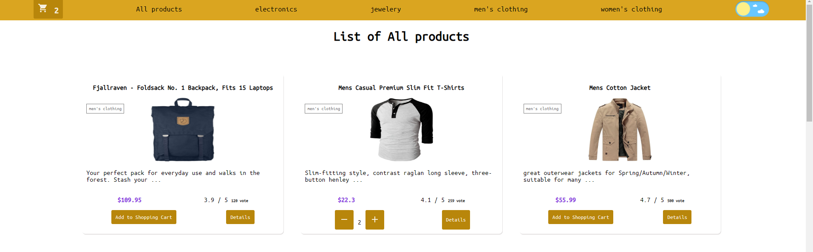

# E-Commerce React-Redux
E-commerce web application using React TypeScript, React Query & Redux


## Demo
Demo is available [here](https://e-commerce-react-redux-zeta.vercel.app/).

## Screenshots




## Run Locally

Clone the project

```bash
  git clone https://github.com/yasinbordbar/e-commerce-react-redux.git
```

Go to the project directory

```bash
  cd e-commerce-react-redux
```

Install dependencies

```bash
  npm install
```

Start the development server

```bash
  npm run dev
```


## Tech Stack


